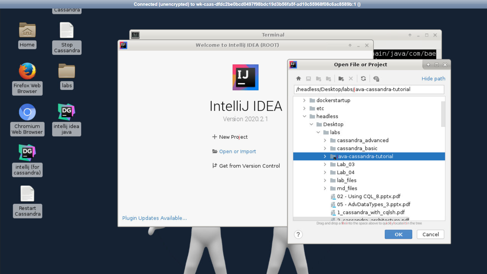
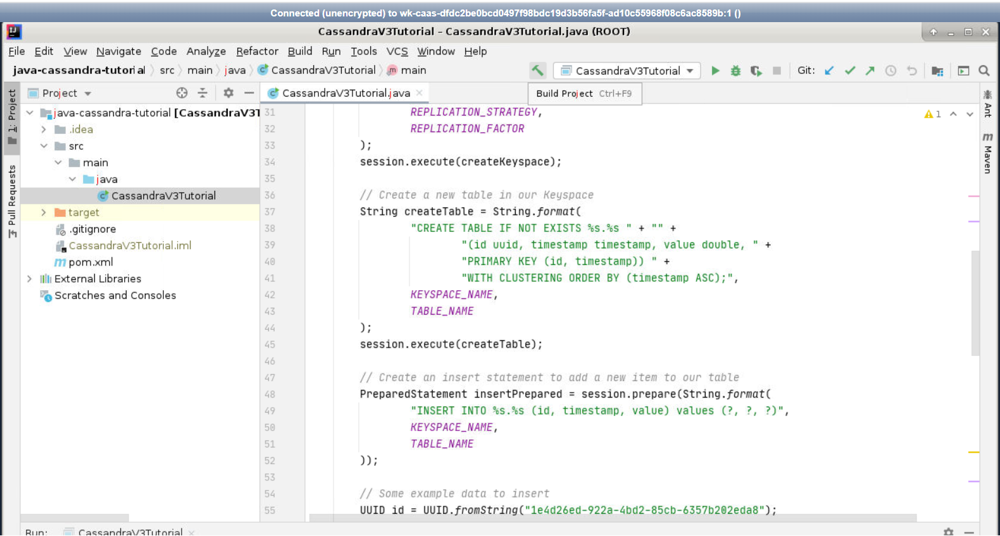
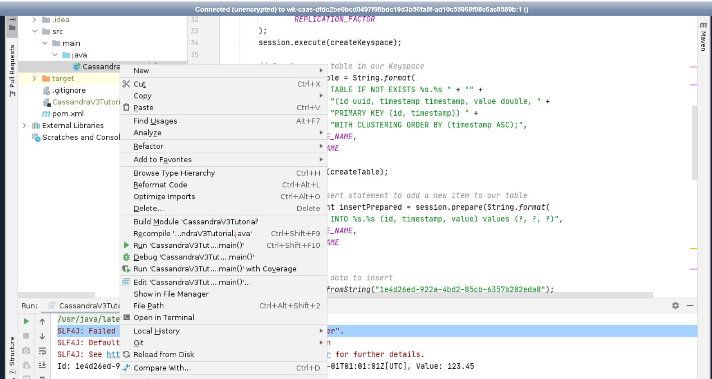
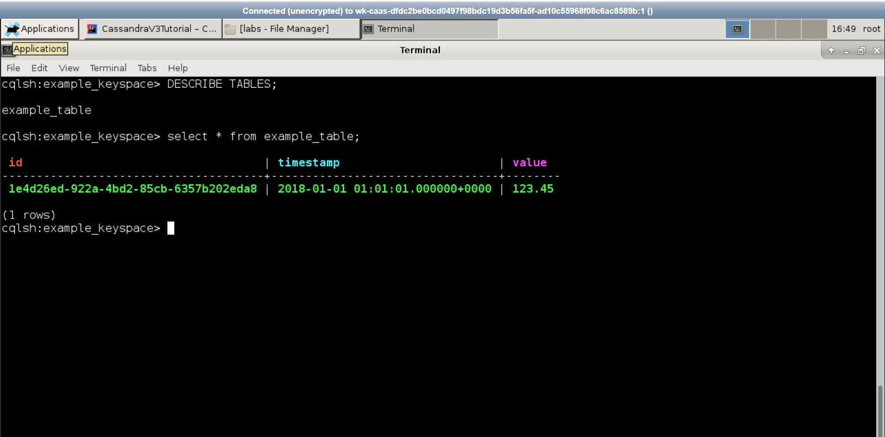

Cassandra – Getting Started with Java
=====================================

Cassandra is a great tool for storing time series data and I happen to
be using it on my current project for that exact purpose.

There are several ways to use Cassandra from Java and many ways to
improve performance, but here I just want to provide a simple “Getting
Started” example. So here it is!

Code for this lab is located in `/headless/Desktop/labs/java-cassandra-tutorial`. Open project in IntelliJ IDE as shown below:



#### Maven Project

Create a Java project, if using Maven, you can add the following
dependencies to your pom.xml file:

```
<dependency>
    <groupId>com.datastax.cassandra</groupId>
    <artifactId>cassandra-driver-core</artifactId>
    <version>3.8.0</version>
</dependency>
```

Here is a simple Java example showing how to connect to Cassandra,
create a keyspace, create a table, insert a row, and select a row:

```
import com.datastax.driver.core.*;
  
import java.time.Instant;
import java.time.ZoneId;
import java.util.Date;
import java.util.UUID;
  
public class CassandraV3Tutorial {
  
    private final static String KEYSPACE_NAME = "example_keyspace";
    private final static String REPLICATION_STRATEGY = "SimpleStrategy";
    private final static int REPLICATION_FACTOR = 1;
    private final static String TABLE_NAME = "example_table";
  
    public static void main(String[] args) {
  
        // Setup a cluster to your local instance of Cassandra
        Cluster cluster = Cluster.builder()
                .addContactPoint("localhost")
                .withPort(9042)
                .build();
  
        // Create a session to communicate with Cassandra
        Session session = cluster.connect();
  
        // Create a new Keyspace (database) in Cassandra
        String createKeyspace = String.format(
                "CREATE KEYSPACE IF NOT EXISTS %s WITH replication = " +
                        "{'class':'%s','replication_factor':%s};",
                KEYSPACE_NAME,
                REPLICATION_STRATEGY,
                REPLICATION_FACTOR
        );
        session.execute(createKeyspace);
  
        // Create a new table in our Keyspace
        String createTable = String.format(
                "CREATE TABLE IF NOT EXISTS %s.%s " + "" +
                        "(id uuid, timestamp timestamp, value double, " +
                        "PRIMARY KEY (id, timestamp)) " +
                        "WITH CLUSTERING ORDER BY (timestamp ASC);",
                KEYSPACE_NAME,
                TABLE_NAME
        );
        session.execute(createTable);
  
        // Create an insert statement to add a new item to our table
        PreparedStatement insertPrepared = session.prepare(String.format(
                "INSERT INTO %s.%s (id, timestamp, value) values (?, ?, ?)",
                KEYSPACE_NAME,
                TABLE_NAME
        ));
  
        // Some example data to insert
        UUID id = UUID.fromString("1e4d26ed-922a-4bd2-85cb-6357b202eda8");
        Date timestamp = Date.from(Instant.parse("2018-01-01T01:01:01.000Z"));
        double value = 123.45;
  
        // Bind the data to the insert statement and execute it
        BoundStatement insertBound = insertPrepared.bind(id, timestamp, value);
        session.execute(insertBound);
  
        // Create a select statement to retrieve the item we just inserted
        PreparedStatement selectPrepared = session.prepare(String.format(
                "SELECT id, timestamp, value FROM %s.%s WHERE id = ?",
                KEYSPACE_NAME,
                TABLE_NAME));
  
        // Bind the id to the select statement and execute it
        BoundStatement selectBound = selectPrepared.bind(id);
        ResultSet resultSet = session.execute(selectBound);
  
        // Print the retrieved data
        resultSet.forEach(row -> System.out.println(
                String.format("Id: %s, Timestamp: %s, Value: %s",
                row.getUUID("id"),
                row.getTimestamp("timestamp").toInstant().atZone(ZoneId.of("UTC")),
                row.getDouble("value"))));
  
        // Close session and disconnect from cluster
        session.close();
        cluster.close();
    }
}
```

#### Run Java Application

Make sure cassandra is running before running the example.





If you would like to look at the data in your local Cassandra database,
you can use the
[CQLSH](https://docs.datastax.com/en/cql/3.3/cql/cql_reference/cqlsh.html)
command line tool.

Type `cqlsh` in the terminal.

This will take you to a “cqlsh\>” prompt:

```
Connected to Test Cluster at 127.0.0.1:9042.
[cqlsh 5.0.1 | Cassandra 3.11.5 | CQL spec 3.4.4 | Native protocol v4]
Use HELP for help.
cqlsh>
```

To view all available Keyspaces:

 `DESCRIBE KEYSPACES;`


You will now see our “example\_keyspace” in the list:

``` {.wp-block-code}
cqlsh> DESCRIBE KEYSPACES;

system_schema  system    system_traces
system_auth    system_distributed    example_keyspace
```

To switch to that Keyspace: `USE example_keyspace;`

``` {.wp-block-code}
cqlsh> USE example_keyspace;
cqlsh:example_keyspace>
```

To show all tables in the keyspace:  `DESCRIBE TABLES;`

You should see the new table “example\_table”:

``` {.wp-block-code}
cqlsh:example_keyspace> DESCRIBE TABLES;

example_table
```

Now from the command line you can view the data in the table by using a
select statement:

```
SELECT * FROM example_table;
```


Which will show the following information:

``` {.wp-block-code}
id                                    | timestamp                       | value
--------------------------------------+---------------------------------+-------
1e4d26ed-922a-4bd2-85cb-6357b202eda8 | 2018-01-01 01:01:01.000000+0000 | 123.45
```





